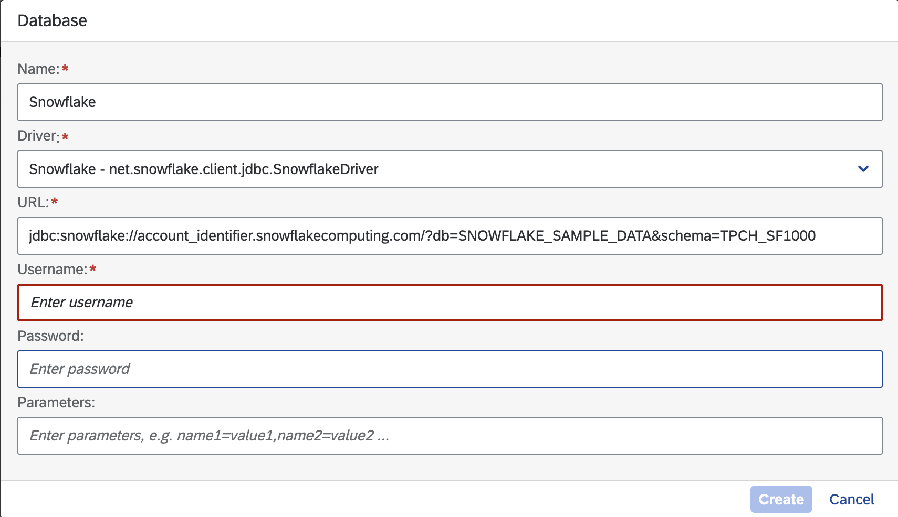
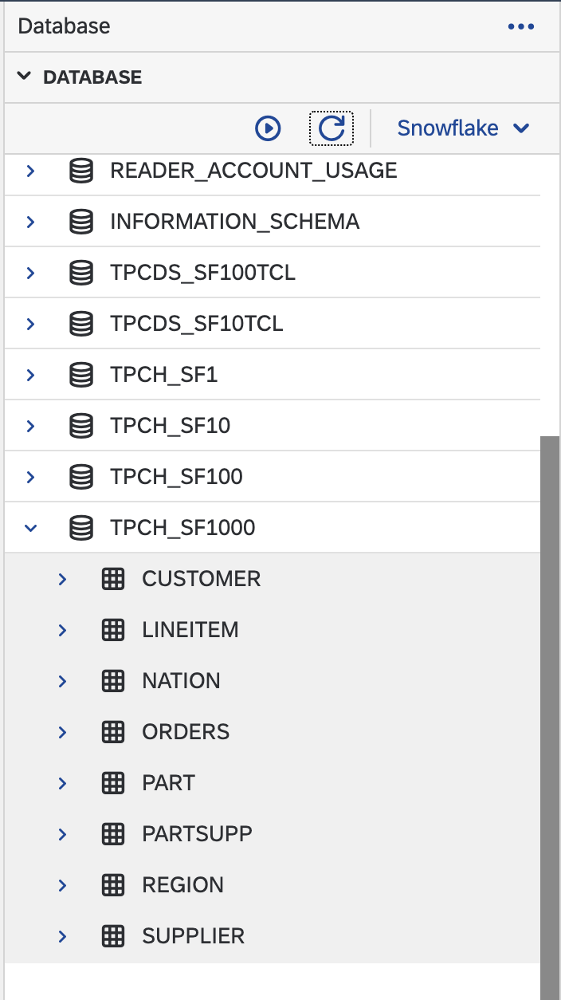
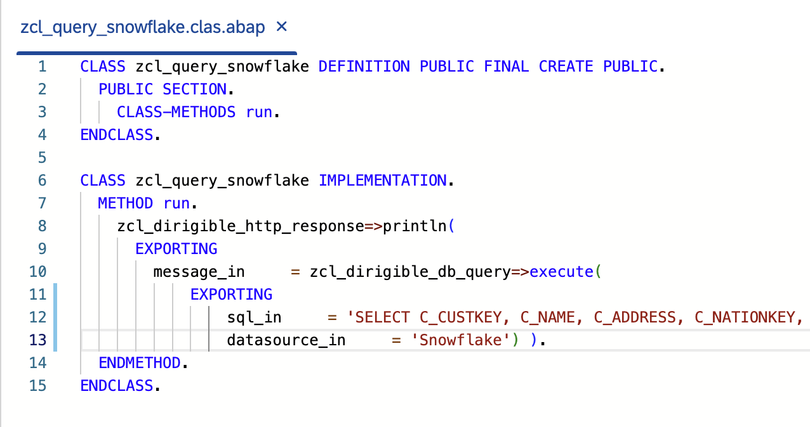
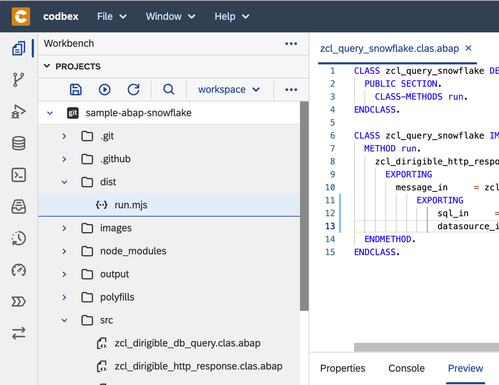
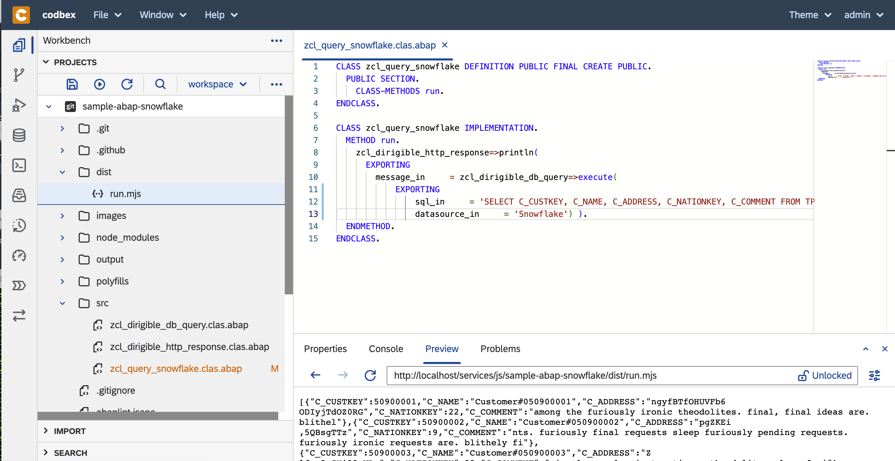

# sample-abap-snowflake
Snowflake connection from ABAP sample backed by open-abap

## Prerequisites: [NodeJs](https://nodejs.org/) 16+

## Running in Dirigible

1. Create a Datasource named `Snowflake`

1. Clone project in Dirigible

2. Publish project

3. Refresh workspace - should appear `dist` folder with a single `run.js` file in it

4. Select run.mjs from the `dist` folder and see some test data prinited in the Preview

